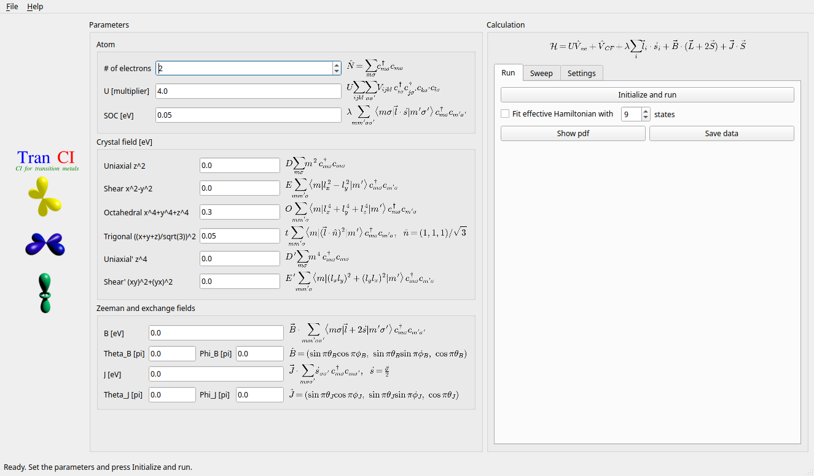
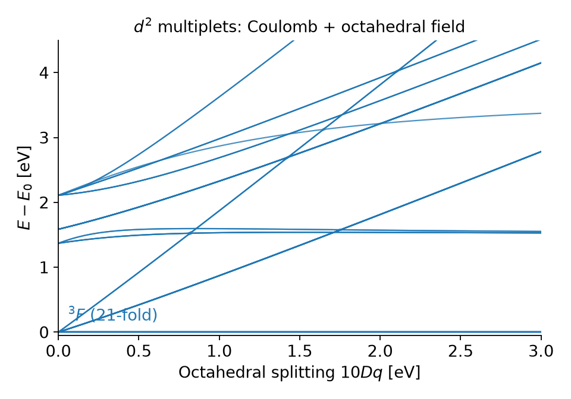
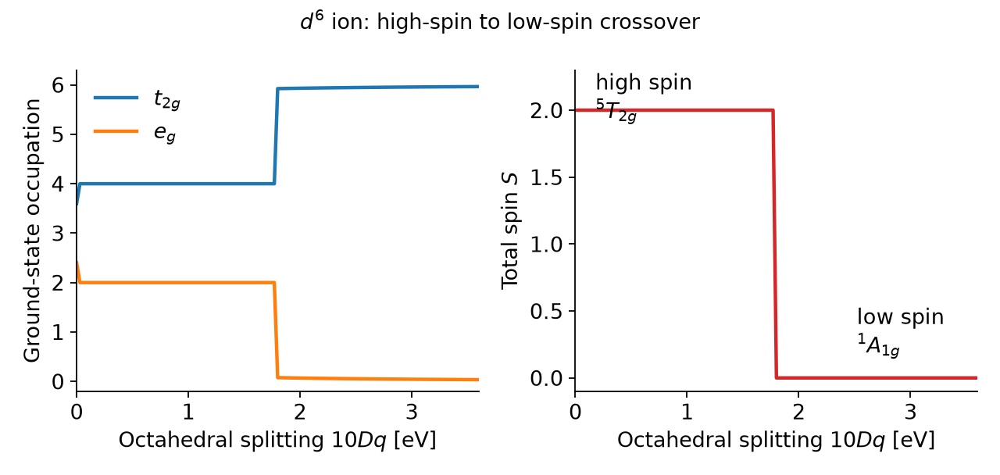
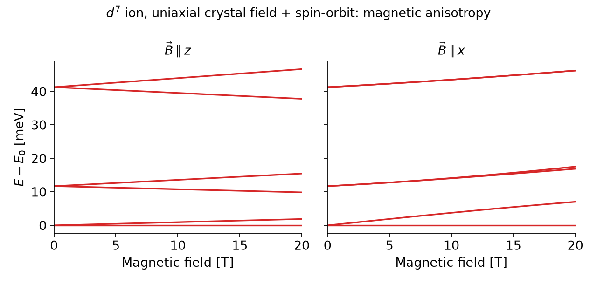
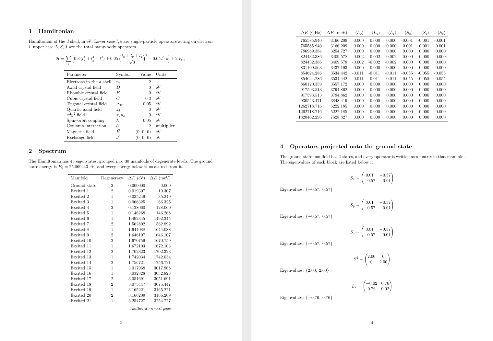

# TranCI — configuration interaction for transition-metal d shells

<p align="center">
  
</p>

TranCI solves the many-body problem of a single transition-metal *d* shell
**exactly**: it builds the full configuration-interaction (exact diagonalization)
Hamiltonian for *n* electrons in the ten *d* spin-orbitals, including the
complete Coulomb interaction, crystal fields of arbitrary symmetry, spin-orbit
coupling and magnetic/exchange fields, and diagonalizes it. Because the largest
space has only 252 states, every calculation takes milliseconds and every
eigenstate is available.

It comes as a Python library, and as a graphical interface that writes a
LaTeX/PDF summary of the spectrum, degeneracies, wavefunctions and operator
expectation values, and that can sweep any parameter.

## Why exact diagonalization?

The *d* orbitals of a transition-metal ion in a solid, on a surface or in a
molecule are compact, so the Coulomb repulsion between the *d* electrons is
comparable to or larger than the splitting induced by the environment. A
single-particle (mean-field) picture then fails: the multiplet structure, Hund's
rules, the high-spin/low-spin competition, the zero-field splitting and the
magnetic anisotropy that arise from spin-orbit coupling in a crystal field are
genuinely many-body effects. TranCI captures all of them without approximation
inside the *d* shell.

Typical questions it answers:

- What is the ground-state multiplet and its degeneracy for a given filling,
  ligand geometry and spin-orbit strength?
- Is the ion high spin or low spin? Where is the crossover?
- What is the magnetic anisotropy (easy axis or easy plane), the zero-field
  splitting and the g-tensor of the ground doublet?
- What effective spin Hamiltonian describes the low-energy manifold?
- What are the orbital occupations, spin/orbital expectation values,
  correlation entropies and dynamical correlators?

## The model

The Hamiltonian is assembled by the user (or by the GUI) as a linear combination
of many-body operators, all of them already expressed in the
$\binom{10}{n_e}$-dimensional basis of Slater determinants:

```math
\mathcal{H} = U\,\hat V_{ee}
  + \hat V_{\mathrm{CF}}
  + \lambda \sum_i \vec{l}_i\cdot\vec{s}_i
  + \vec{b}\cdot(\vec{L}+2\vec{S})
  + \vec{J}\cdot\vec{S}
```

Lower-case $\vec l_i$, $\vec s_i$ act on electron $i$; upper-case
$\vec L$, $\vec S$ are the total angular momenta. All energies are in **eV**.

- **Coulomb interaction.**
  $\hat V_{ee}=\sum_{ijkl\sigma\sigma'} V_{ijkl}\ c^\dagger_{i\sigma}c^\dagger_{j\sigma'}c_{k\sigma'}c_{l\sigma}$
  is the full Slater-Condon tensor of the *d* shell. The prefactor $U$ is a
  **dimensionless multiplier** of a fixed tensor, not $F^0$ in eV: with
  multiplier $u$ the Racah parameters are $B = 52.9\ u$ meV and
  $C = 210\ u$ meV ($C/B \approx 4$). Free 3d ions correspond to
  $1.5 \lesssim u \lesssim 2.5$.
- **Crystal fields.** Sums of single-particle operators built from powers of
  $\vec l_i$: uniaxial $D\sum_i l_{z,i}^2$ (splits the shell as $0, D, 4D$),
  rhombic $E\sum_i (l_{x,i}^2-l_{y,i}^2)$, octahedral
  $O\sum_i (l_{x,i}^4+l_{y,i}^4+l_{z,i}^4)$ (which gives $10Dq = 6\ O$,
  $t_{2g}$ lowest for $O>0$), trigonal $t\sum_i(\vec l_i\cdot\hat n)^2$ with
  $\hat n = (1,1,1)/\sqrt3$, plus $z^4$ and $(l_xl_y)^2+(l_yl_x)^2$ terms.
  Any other one-body field can be supplied as a $10\times10$ matrix.
- **Spin-orbit coupling.** $\lambda$ is the one-electron constant and is
  positive for every filling; Hund's third rule ($J=|L-S|$ below half filling,
  $J=L+S$ above) comes out of the diagonalization on its own.
- **Zeeman and exchange fields.** $\vec b = \mu_B \vec B$ (1 T
  $\simeq 5.79\times10^{-5}$ eV) couples to $\vec L + 2\vec S$; the exchange
  field $\vec J$ couples to the spin only and models a magnetic substrate.

## What it looks like

**Multiplets in a crystal field.** The full spectrum of a $d^2$ ion as a
function of the octahedral splitting, a Tanabe-Sugano-type diagram computed
directly from the many-body Hamiltonian ($u = 2$, i.e. $B \approx 106$ meV,
$C \approx 420$ meV).

<p align="center">
  
</p>

**High-spin to low-spin crossover.** Ground-state $t_{2g}/e_g$ occupations
and total spin of a $d^6$ ion (e.g. $\mathrm{Fe}^{2+}$) versus octahedral
splitting. With $u=2$ the $^5T_{2g}\to{}^1A_{1g}$ crossover occurs at
$10Dq \approx 1.8$ eV.

<p align="center">
  
</p>

**Magnetic anisotropy.** Zeeman splitting of the lowest levels of a $d^7$ ion
in a uniaxial crystal field with spin-orbit coupling ($u=2$, $D = 0.1$ eV,
$\lambda = 50$ meV). The ground Kramers doublet splits linearly for
$\vec B \parallel z$ and only quadratically for $\vec B \parallel x$: the
crystal field plus spin-orbit coupling has produced an easy axis.

<p align="center">
  
</p>

**The PDF summary.** Every GUI run produces a LaTeX/PDF report with the
Hamiltonian and its parameters, the spectrum grouped into degenerate
manifolds, expectation values of $\vec L$ and $\vec S$ for every eigenstate,
the operators projected onto the ground-state manifold, the wavefunctions and,
optionally, a fitted effective spin Hamiltonian.

<p align="center">
  
</p>

All the plots above are generated by `figures/make_figures.py`.

## Quick start from Python

The library is not installed as a package; prepend the source directory to the
path. A complete calculation is three lines: load the operators for a filling,
write the Hamiltonian, diagonalize.

```python
import sys; sys.path.append("/path/to/tranci/src")
from tranci.atom import get_atom

Atom = get_atom(ne=3)                   # d^3 ion, 120 many-body states
V  = Atom.Operator["Coulomb"]           # electron-electron repulsion
CF = Atom.Operator["z2"]                # uniaxial crystal field
LS = Atom.Operator["ls"]                # spin-orbit coupling
Sz = Atom.Operator["sz"]                # total S_z

H = 2*V + 0.3*CF + 0.05*LS + 0.01*Sz    # your Hamiltonian, in eV
M = Atom.get_manifolds(H)               # exact diagonalization

print(M.get_gs_multiplicity())          # ground-state degeneracy
print(M.get_excitations())              # excitation energies of each manifold [eV]
print(M.get_gs_projected_eigenvalues(Sz))          # <S_z> in the ground manifold
print(M.get_gs_projected_eigenvalues(Atom.Operator["dxy"]))  # orbital occupation
```

`Atom.Operator` is a dictionary of many-body matrices:

| Keys | Operators |
|------|-----------|
| `sx sy sz s2` | total spin $S_\alpha$, $S^2$ |
| `lx ly lz l2` | total orbital angular momentum $L_\alpha$, $L^2$ |
| `jx jy jz j2` | total angular momentum $J_\alpha$, $J^2$ |
| `Coulomb` (`vc`) | Slater-Condon interaction $\hat V_{ee}$ |
| `ls` | one-body spin-orbit coupling $\sum_i \vec l_i\cdot\vec s_i$ |
| `x2 y2 z2 x4 y4 z4 x2y2` | crystal-field generators $\sum_i l_{\alpha,i}^2$, $\sum_i l_{\alpha,i}^4$, ... |
| `dz2 dxy dxz dyz dx2y2` | occupation of each cubic-harmonic orbital |

`Atom.SP_Operator` holds the same operators as $10\times10$ single-particle
matrices, and `Atom.one2many(m)` promotes any $10\times10$ matrix to the
many-body basis, which is how custom crystal fields are built. The
`Lowest_States` object returned by `get_manifolds` also provides
`get_gtensor()`/`get_principal_g()` for a Kramers doublet,
`get_dynamical_correlator(A, B)`, `get_correlation_entropy(wf)` and
`get_degeneracies()`; `effectivehamiltonian.effective_spin_hamiltonian` fits
the low-energy block with spin and orbital operators and returns LaTeX.

### Examples and notebooks

`examples/` contains short scripts (octahedral field, orbital projections
versus crystal field, single-particle versus many-body occupations, effective
Hamiltonian, dynamical spin correlator, correlation entropy) and
`notebooks/` the corresponding Jupyter notebooks (Hund's rules, Zeeman
splitting, anisotropy versus crystal field, custom crystal fields). They locate
the library relative to the working directory, so run them from inside their
own folder:

```bash
cd examples/octahedral && python main.py
```

## Graphical interface

```bash
tranci            # Linux / Mac, after install.py
bin\tranci.bat    # Windows
```

Set the number of electrons, the Coulomb multiplier, the spin-orbit coupling,
the crystal-field and field parameters (the second-quantized form of every term
is shown next to its field), press **Initialize and run** and then
**Show pdf**. The **Sweep** tab scans any parameter and plots the spectrum,
excitation energies, degeneracies or the expectation value of an operator as a
function of it. **Save data** copies the `.tex`, `.pdf`, `.OUT` and
`parameters.json` files into `./tranci_data`; File → Save/Load parameters
round-trips all inputs through JSON.

## Installation

Requirements: Python 3 with `numpy`, `scipy` and `matplotlib`. The graphical
interface additionally needs `PyQt5` and a `pdflatex` installation (TeX Live or
MacTeX on Linux/Mac, MiKTeX on Windows); the effective-Hamiltonian fitting
needs `jax`.

```bash
git clone https://github.com/joselado/tranci
cd tranci
python install.py
```

`install.py` only adds `bin/` to your `PATH` (it appends to `~/.bashrc` or
`~/.bash_profile` on Linux/Mac and edits the user `Path` in the registry on
Windows). Open a new terminal afterwards and run `tranci`. The library itself
needs no installation: add `src/` to `sys.path` as in the quick start above.

TranCI runs on Linux, Mac and Windows.

## Documentation and license

The user manual, `doc/tranci_manual.pdf`, documents the physics conventions of
every operator, the validation against the analytic $d^2$ term spectrum, the
full Python API and the graphical interface in detail.

TranCI is released under the GNU General Public License v3, see
`LICENSE.md`.
